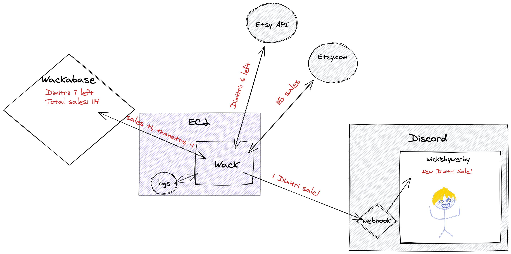

# wacks by warby


Send Discord alerts whenever there's new sales at [WicksByWerby](https://www.etsy.com/shop/WicksByWerby)



## Running

You'll need a `.env` file with

```
ETSY_API_KEY=xxx
ETSY_SECRET=xxx
ETSY_TOKEN=xxx
ETSY_TOKEN_SECRET=xxx
DISCORD_WEBHOOK=xxx
DISCORD_DEBUG_WEBHOOK=xxx

# Shift4Shop
SHIFT4SHOP_PRIVATE_KEY=xxx
SHIFT4SHOP_PUBLIC_KEY=xxx
SHIFT4SHOP_SHOP_TOKEN=xxx

# Square
SQUARE_MAIN_LOCATION_ID=xxx
SQUARE_BACKUP_LOCATION_ID=xxx
SQUARE_CLIENT_ID=xxx
SQUARE_CLIENT_SECRET=xxx
```

To run:

```
# Etsy integration
PYTHONPATH=src python3 -m wacksbywarby.wack

# Shift4Shop integration
PYTHONPATH=src python3 -m wacks4shop.wack

# Listing Shift4Shop products (useful for finding the shift4shop_id for werbies.json)
PYTHONPATH=src python3 -m wacks4shop.ls

# Square integration
PYTHONPATH=src python3 -m wacks4square.wack
```

### For square...

You will also need an initial credentials file. You'll need to get the app authorized then paste your SquareCredentials in `data/wack4square/square_creds.json`. For example:

```json
{
  "access_token": "xxx",
  "refresh_token": "yyy",
  "short_lived": false,
  "expires_at": "2023-03-21T18:24:57Z",
  "merchant_id": "xxx",
  "token_type": "bearer"
}
```

This file will be overwritten by the refresh flow whenever we need to refresh the token.

## Developer Setup

```sh
# Set up a virtual env
$ python -m venv venv
$ source venv/bin/activate

# Install dependencies
pip install -r requirements.txt
```

### Installing new dependencies

We use [pip-tools](https://github.com/jazzband/pip-tools) for dependency management. If you need a new dependency, add it to `requirements.in`, then:

```sh
# Install pip tools
$ python -m pip install pip-tools

# Generate a requirements.txt file
pip-compile requirements.in
```
